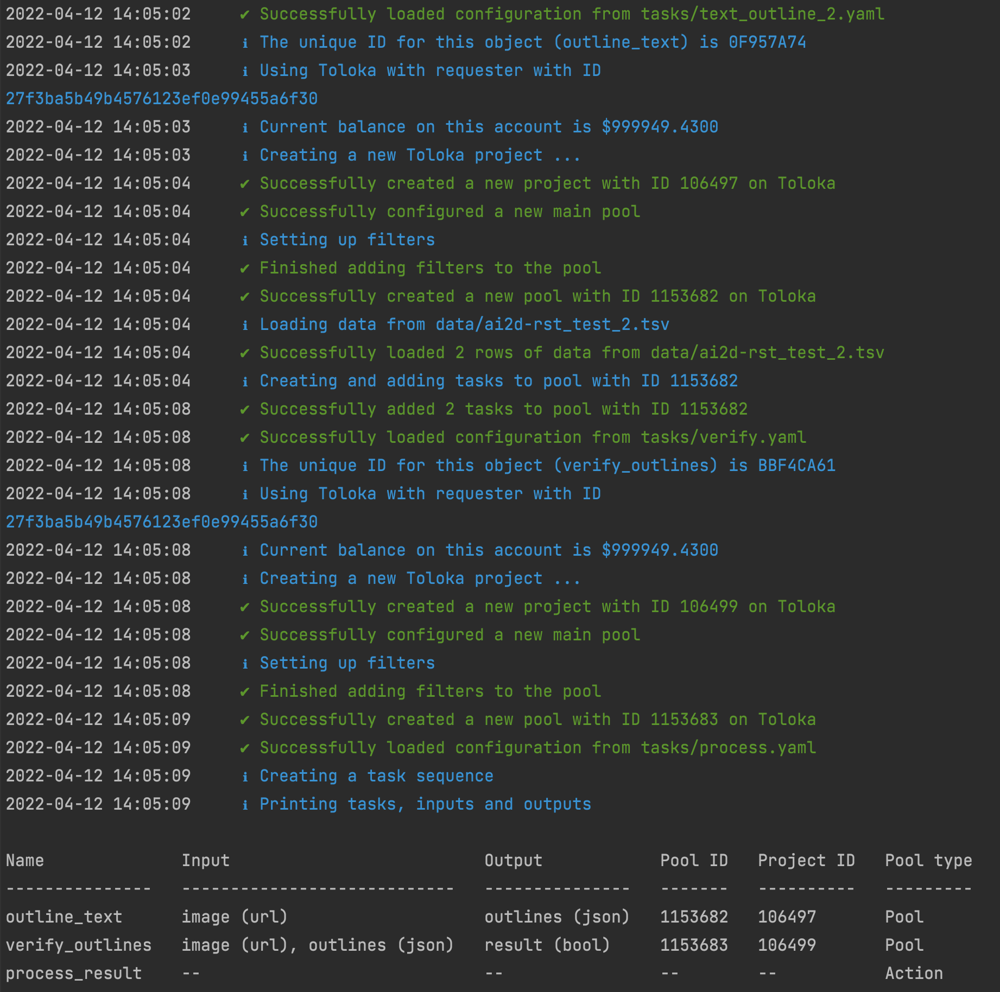

# 𝚊𝚋𝚞𝚕𝚊𝚏𝚒𝚊: A tool for fair and reproducible crowdsourcing

## Introduction

𝚊𝚋𝚞𝚕𝚊𝚏𝚒𝚊 is a tool for creating and deploying crowdsourcing tasks on the the [Toloka](https://toloka.ai) crowdsourcing platform. The tool allows you to create crowdsourcing tasks using pre-defined task interfaces and YAML configuration files.

The pipelines can consist of crowdsourcing tasks as well as `action`s that perform operations before, between or after tasks. `Forward` action is used to transfer tasks from one pool to another based on task output. `Aggregate` action is used to aggregate the output of a task; the action uses your aggregation algorithm of choice to determine the most probable correct output to a task based on majority vote. `SeparateBBoxes` is an action that takes an image with several bounding boxes, separates the bounding boxes to one per image, and creates new tasks from those.

If you wish to move tasks from one pool to another based on the acceptance status of the task, not the task output, you can configure the receiving pool under `actions` with keys `on_submitted`, `on_accepted` or `on_rejected`. For example, if you wish rejected work to go back to the pool to be re-completed by another worker, you can configure the current pool as value to the key `on_rejected`.

In order to deploy your crowdsourcing tasks to Toloka, the tool needs to read your credentials from a JSON file `creds.json` in the root of the repository. Remember to never add this file to public version control. The contents of the file should be the following:

```
{
    "token": "YOUR_OAUTH_TOKEN",
    "mode": "SANDBOX"
}
```

When you've tested your pipeline in the Toloka sandbox, change `"SANDBOX"` to `"PRODUCTION"`.

See `examples/` for tutorial pipelines.

## Ensuring fair worker rewards

**abulafia** has a built-in mechanism that guides the user to determine rewards that result in a fair hourly wage ($12) for the crowdsourcing workers. In the pool configuration, the user should add a key `estimated_time_per_suite`. The value for the key should be the estimated time in seconds it takes for the worker to complete one task suite. Based on this value and the value `reward_per_assignment`, the tool checks if the reward is high enough to result in a fair hourly wage. The user is presented with a warning and prompted to cancel the pipeline if the configured reward is too low. A warning is also raised if `estimated_time_per_suite` is not found in the pool configuration.

To calculate a fair reward per task suite, you can use the interactive script `utils/calculate_fair_rewards.py`.

## YAML configuration

### Crowdsourcing tasks

The specifications of each crowdsourcing task are configured in YAML files. Each configuration file should include 

- `name` of the task
- the types of `input` and `output` data under key `data`
- `actions`, if applicable
- `interface` settings
- `project` settings
- `pool` settings

Optionally, you can add `quality_control` settings. Options for quality control are the following:

- [Fast responses](https://toloka.ai/docs/guide/concepts/quick-answers.html)
- [Skipped assignments](https://toloka.ai/docs/guide/concepts/skipped-assignments.html)
- Re-do assignments from banned users
- [Captcha](https://toloka.ai/docs/guide/concepts/captcha.html)
- [Golden set](https://toloka.ai/en/docs/toloka-kit/reference/toloka.client.collectors.GoldenSet) (performance on control tasks)

See `examples/config/` for example YAML configuration files.

### Blocklist

If you want to prevent some users from having access to a specific pool, add the key `blocklist` under `pool` configuration and give a path to a tsv-file containing the column `user_id` with user id:s of the workers you would like to block (example in `examples/config/detect_text.yaml`). 

### Actions

Similarly as crowdsourcing tasks, each action in your pipeline requires its own configuration file. `examples/action_demo.py` is an example pipeline that uses actions `Aggregate`, `Forward` and `SeparateBBoxes`.

**Forward** action requires the keys 
- `name` of the action
- `data` 
- `source`, the pool from which tasks go to the forward action
- variable names for the possible outputs for the source task and pools to which they should be forwarded are configured under `on_result` under `actions`. 
  - You can either configure a pool to which to forward, or use the keywords `accept` or `reject` to automatically accept or reject tasks based on the output. These keywords are meant to be used in verification pools. For example, you can ask workers to determine if an image has been annotated correctly. Then, you can use aggregation and forwarding to automatically accept or reject the _original_ task by using key-value pairs such as `correct: accept` and `incorrect: reject` in your Forward configuration. You can also configure both accepting/rejecting and a next pool. In that case, use a list as the value for the variable name of the output. See `examples/action_demo.py` and its configuration files for example of use. 

Configure `Forward` actions to the source pool/action under `actions` with the key `on_result`.


**Aggregate** action requires the keys:
- `name` of the action
- `source`, the pool from which tasks go to the aggregate action
- The forward action to which the aggregated results will be sent should be configured under key `on_result` under `actions`
- `method`, which is the desired [aggregation algorithm](https://toloka.ai/en/docs/crowd-kit/). For now, categorical methods are supported.


Configure `Aggregate` actions to the source pool under `actions` with the key `on_closed`; aggregation can only be done after all tasks are complete and the pool is closed.

**SeparateBBoxes** action requires the keys:

- `name` of the action
- The type of data that the action produces should be configured under the key `output` under `data`

If you wish to start your pipeline with `SeparateBBoxes`, configure it under `actions` as value for the key `data_source` in the following pool. Then, the action reads a tsv-file with images and bounding boxes and separates the bounding boxes to one per task. Note that the bounding boxes must be in the format that Toloka uses. If you want to have the action in the middle of a pipeline, you can configure it in your `Forward` action under one of the possible outputs of your task (for example; if you want all tasks with the output `True` to be forwarded to `SeparateBBoxes`, configure `True: name_of_your_separatebboxes_action` under `on_result` under `actions`. See `config/forward_verify.yaml` for an example). If you want, you can add a label for the bounding boxes in the resulting tasks, by giving the label as a value for the parameter `add_label`. Labelled bounding boxes are used in, for example, `AddOutlines` and `LabelledSegmentationVerification` tasks.

## Pre-defined interfaces

Define crowdsourcing tasks in your executable Python file by creating one or many of the task objects listed below. They all take arguments `configuration`, which is the path to the correct YAML configuration file, and `client`, which should be your Toloka client.

### ImageClassification

Interface for binary image classification tasks. 

|input|output|
|-----|------|
| `url` (image) | `boolean` (true/false) |

### ImageSegmentation

Interface for image segmentation tasks. 

|input|output|
|-----|------|
|`url` (image) | `json` (bounding boxes) |

### AddOutlines

Interface for image segmentation tasks with pre-existing labelled outlines.

|input|output|
|-----|------|
|`url` (image) | `json` (bounding boxes) |
| `json` (bounding boxes) | |

### SegmentationClassification

Interface for binary segmentation classification tasks.

|input|output|
|-----|------|
|`url` (image) | `boolean` (true/false) |
| `json` (bounding boxes) | |

input: url to an image, JSON coordinates of bounding boxes\
output: boolean

### SegmentationVerification

Interface for binary segmentation verification tasks.

|input|output|
|-----|------|
|`url` (image) | `boolean` (true/false) |
| `json` (bounding boxes) | |

### LabelledSegmentationVerification

Interface for verifying image segmentation tasks where the bounding boxes have labels.

|input|output|
|-----|------|
|`url` (image) | `boolean` (true/false) |
| `json` (bounding boxes) | |

### FixImageSegmentation

Interface for fixing and adding more outlines to images with pre-existing non-labelled outlines.

|input|output|
|-----|------|
|`url` (image) | `json` (bounding boxes) |
| `json` (bounding boxes) | |

### MulticlassVerification

Interface for verification tasks with more than two possible outputs (for example: *yes*, *no* and *maybe*).

|input|output|
|-----|------|
|`url` (image) | `string` (values) |
| `json` (bounding boxes) | |

### TextClassification

Interface for the classification of text.

|input|output|
|-----|------|
|`string`|`string`|

### TextAnnotation

Interface for annotation words or other segments within a text.

|input|output|
|-----|------|
|`string`|`json`|


